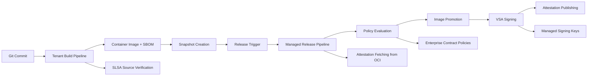

# SLSA-Konflux End-to-End Demonstration

This repository demonstrates how to achieve end-to-end SLSA (Supply-chain Levels for Software Artifacts) compliance using Konflux. It provides a complete, self-contained example that you can run locally to understand how Konflux implements SLSA security guarantees.

## 🎯 What This Demonstrates

- **SLSA Build Level 3**: Cryptographic provenance for all build artifacts
- **SLSA Source Level 3**: Source code verification and provenance 
- **Trust Boundaries**: Clear separation between developer and platform contexts
- **VSA Generation**: Verification Summary Attestations for compliance validation
- **End-to-End Security**: Complete supply chain protection from source to deployment

## 🚀 Quick Start

```bash
# 1. Clone this repository
git clone https://github.com/your-org/slsa-konflux-example
cd slsa-konflux-example

# 2. Bootstrap cluster with SLSA components
./scripts/bootstrap-cluster.sh

# 3. Setup end-to-end SLSA workflow  
./scripts/setup-end-to-end-demo.sh

# 4. Trigger workflow with a commit
git commit --allow-empty -m "Trigger SLSA demo workflow"
git push origin main

# 5. Watch the automatic workflow
kubectl get pipelineruns -n tenant-namespace -w
kubectl get pipelineruns -n managed-namespace -w
```

## 📋 Prerequisites

- **Kubernetes cluster** (local or cloud)
- **Docker** or compatible container runtime
- **kubectl** configured for your cluster
- **Git** for source code management

**Supported Platforms:**
- ✅ macOS (Intel and Apple Silicon)
- ✅ Linux (x86_64 and ARM64)

## 🏗️ Architecture Overview

This demonstration is built around two key trust contexts:

### Tenant Context (Developer-Controlled)
- **Source verification** with SLSA provenance (git-clone-slsa task)
- **Build pipelines** producing container images and SBOMs
- **Snapshot creation** with image references and build metadata

### Managed Context (Platform-Controlled)  
- **Snapshot consumption** and attestation fetching from OCI registries
- **Authoritative policy evaluation** against real build attestations
- **VSA generation and signing** with managed keys
- **Image promotion** and attestation publishing



## 📁 Repository Structure

```
slsa-konflux-example/
├── tenant-context/          # Developer-controlled components
│   ├── tasks/               # Build-time verification tasks
│   ├── pipelines/           # Build pipeline definitions
│   └── policies/            # Build-time security policies
├── managed-context/         # Platform-controlled components
│   ├── tasks/               # Release-time tasks
│   ├── pipelines/           # Release pipeline definitions
│   └── policies/            # Release security policies
├── shared/                  # Cross-context configurations
│   ├── trust-artifacts/     # Trust artifact schemas (for reference)
│   └── schemas/             # Data format definitions
├── examples/                # Sample applications
│   ├── go-app/              # Go application demo
│   └── python-app/          # Python application demo
├── scripts/                 # Installation and setup
└── docs/                    # Documentation
```

## 🔒 Trust Model

The security model is based on **trust boundaries** that ensure different components operate with appropriate isolation:

1. **Source Trust**: Verify code provenance and integrity
2. **Build Trust**: Validate build environment and process
3. **Release Trust**: Ensure only verified artifacts are released
4. **Consumer Trust**: Provide verifiable attestations for deployment

See [docs/trust-model.md](docs/trust-model.md) for detailed explanation.

## 🎓 Learning Path

1. **Start Here**: [Quick Start Guide](docs/quick-start.md) - Get running in 15 minutes
2. **Understand**: [Architecture Guide](docs/architecture.md) - How it all works together  
3. **Customize**: [Configuration Guide](docs/configuration.md) - Adapt for your needs
4. **Extend**: [Development Guide](docs/development.md) - Add custom components

## 📖 Documentation

- **[Installation Guide](docs/installation.md)** - Detailed setup instructions
- **[Trust Model](docs/trust-model.md)** - Security architecture explanation
- **[SLSA Compliance](docs/slsa-compliance.md)** - How we meet SLSA requirements
- **[Troubleshooting](docs/troubleshooting.md)** - Common issues and solutions
- **[API Reference](docs/api-reference.md)** - Task and pipeline specifications

## 🛠️ Components

### Tenant Context Tasks
- **[git-clone-slsa](tenant-context/tasks/git-clone-slsa/)** - SLSA-aware source retrieval

### Managed Context Tasks  
- **[conforma-vsa](managed-context/tasks/conforma-vsa/)** - Trusted policy evaluation and VSA payload generation
- **[vsa-sign](managed-context/tasks/vsa-sign/)** - VSA generation and signing
- **[release-verify](managed-context/tasks/release-verify/)** - Final release validation

### Example Applications
- **[Go Application](examples/go-app/)** - Simple web service with security scanning
- **[Python Application](examples/python-app/)** - Flask app with dependency verification

## 🔧 Development

To contribute or customize this demonstration:

```bash
# Run tests
make test

# Validate configuration
make validate

# Run security checks  
make security-check

# Generate documentation
make docs
```

See [CONTRIBUTING.md](CONTRIBUTING.md) for detailed development guidelines.

## 📊 SLSA Compliance Matrix

| SLSA Requirement | Implementation | Status |
|-----------------|----------------|---------|
| Source verification | git-clone-slsa task | ✅ |
| Build provenance | Tekton Chains | ✅ |
| Build isolation | Kubernetes namespaces | ✅ |
| Artifact signing | Cosign integration | ✅ |
| Policy enforcement | Conforma evaluation | ✅ |
| VSA generation | Custom task | ✅ |

## 🤝 Community

- **Issues**: [GitHub Issues](https://github.com/your-org/slsa-konflux-example/issues)
- **Discussions**: [GitHub Discussions](https://github.com/your-org/slsa-konflux-example/discussions)  
- **Slack**: `#konflux-slsa` in Kubernetes Slack

## 📄 License

This project is licensed under the Apache License 2.0 - see the [LICENSE](LICENSE) file for details.

## 🙏 Acknowledgments

This demonstration builds on the excellent work of:
- [Konflux](https://konflux-ci.dev/) - Secure software supply chain platform
- [SLSA](https://slsa.dev/) - Supply-chain Levels for Software Artifacts framework
- [Tekton](https://tekton.dev/) - Cloud-native CI/CD pipeline framework
- [Sigstore](https://sigstore.dev/) - Software signing and verification

---

**Ready to get started?** Follow the [Quick Start Guide](docs/quick-start.md) to see SLSA in action!