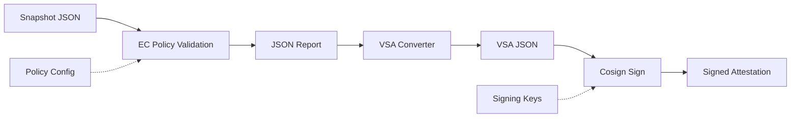

# Conforma VSA Task

This task performs Enterprise Contract policy evaluation on container images and generates signed SLSA Verification Summary Attestations (VSA).

## Overview

The `conforma-vsa` task is an integrated solution that:
1. Accepts a Snapshot (ApplicationSnapshot spec) with container images
2. Runs Enterprise Contract policy evaluation using `ec validate image`
3. Converts EC JSON output to SLSA VSA format
4. Signs the VSA with cosign and attaches it to the image

This task operates in the **managed context** with access to signing keys, maintaining strict trust boundary separation.

## Architecture



## Components

### 1. Tekton Task (`conforma-vsa.yaml`)
**Main task performing end-to-end VSA generation and signing**

**Steps**:
1. `write-snapshot` - Writes Snapshot JSON to file
2. `validate` - Runs `ec validate image` against policy
3. `report-json` - Outputs EC JSON report
4. `convert-to-vsa` - Converts EC JSON to SLSA VSA format (inline Go converter)
5. `sign-vsa` - Signs VSA with cosign and attaches to image
6. `assert` - Validates final result based on STRICT mode

### 2. Security Configuration (`signing-secrets-template.yaml`)
**Kubernetes secrets for secure operation**:
- Cosign signing keys (private/public key pair)
- ServiceAccount with minimal permissions
- RBAC configuration

### 3. Setup Automation (`setup-cosign-integration.sh`)
**Automated deployment**:
- Cosign key pair generation
- Secret creation and deployment
- Task deployment


## Usage Example

```yaml
apiVersion: tekton.dev/v1
kind: TaskRun
metadata:
  name: conforma-vsa-example
  namespace: managed-context
spec:
  taskRef:
    name: conforma-vsa
  params:
    - name: IMAGES
      value: |
        {
          "components": [
            {
              "containerImage": "quay.io/example/app@sha256:abcd1234..."
            }
          ]
        }
    - name: POLICY_CONFIGURATION
      value: "enterprise-contract-service/default"
    - name: PUBLIC_KEY
      value: "k8s://managed-context/cosign-pub"
    - name: STRICT
      value: "true"
  workspaces:
    - name: build-artifacts
      emptyDir: {}
    - name: vsa-results
      emptyDir: {}
    - name: signing-config
      secret:
        secretName: vsa-signing-key
```

## Quick Start

### Prerequisites

- Kubernetes cluster with Tekton Pipelines installed
- `kubectl` configured for cluster access
- `cosign` v2.2.0 or later
- Enterprise Contract policy configuration

### Installation

1. **Create the managed namespace**:
   ```bash
   kubectl create namespace managed-context
   ```

2. **Generate cosign signing keys**:
   ```bash
   cosign generate-key-pair
   # Creates cosign.key and cosign.pub
   ```

3. **Create signing secret**:
   ```bash
   kubectl create secret generic vsa-signing-key \
     --namespace=managed-context \
     --from-file=cosign.key=cosign.key \
     --from-file=cosign.pub=cosign.pub
   ```

4. **Deploy the task**:
   ```bash
   kubectl apply -f conforma-vsa.yaml
   ```

5. **Create EnterpriseContractPolicy** (if needed):
   ```bash
   kubectl apply -f - <<EOF
   apiVersion: appstudio.redhat.com/v1alpha1
   kind: EnterpriseContractPolicy
   metadata:
     name: default
     namespace: enterprise-contract-service
   spec:
     sources:
       - name: Default
         policy:
           - github.com/enterprise-contract/ec-policies//policy/lib
           - github.com/enterprise-contract/ec-policies//policy/release
   EOF
   ```

## Security Architecture

### Trust Boundary Separation

- **Managed Context**: Exclusive access to signing keys (`vsa-signing-key` secret)
- **Policy Evaluation**: Uses Enterprise Contract with configurable policy sources
- **Attestation Signing**: Cosign signs VSA and attaches to image

### Security Controls

1. **Namespace Isolation**: Task runs in managed namespace with signing key access
2. **Key Isolation**: Signing keys stored in Kubernetes secret, mounted read-only
3. **Policy Verification**: Enterprise Contract validates images against policy
4. **Attestation Integrity**: Cosign cryptographic signing with transparency log support

## Usage

### Task Parameters

| Parameter | Description | Default | Required |
|-----------|-------------|---------|----------|
| `IMAGES` | Snapshot spec JSON (ApplicationSnapshot format) | - | Yes |
| `POLICY_CONFIGURATION` | EnterpriseContractPolicy name or git URL | `enterprise-contract-service/default` | No |
| `PUBLIC_KEY` | Public key for signature verification | `""` | No |
| `STRICT` | Fail task if policy fails | `"true"` | No |
| `HOMEDIR` | Home directory for task execution | `/tekton/home` | No |
| `EFFECTIVE_TIME` | Time for policy evaluation | `"now"` | No |
| `verifier-id` | Verifier identifier for VSA | `https://managed.konflux.example.com/conforma-vsa` | No |

### Task Results

| Result | Description |
|--------|-------------|
| `TEST_OUTPUT` | Short summary of policy evaluation for each image |
| `vsa-path` | Path to generated VSA file |
| `vsa-digest` | SHA256 digest of the generated VSA |

### Workspaces

| Workspace | Description | Required |
|-----------|-------------|----------|
| `build-artifacts` | Build artifacts from tenant context | Yes |
| `vsa-results` | VSA output and evidence | Yes |
| `signing-config` | Managed signing key configuration | No (optional) |

## Verification

After signing, verify the VSA attestation:

```bash
# Get the image reference from your snapshot
IMAGE_REF="quay.io/example/app@sha256:abcd1234..."

# Verify the attestation
cosign verify-attestation \
  --type https://slsa.dev/verification_summary/v1 \
  --key cosign.pub \
  "$IMAGE_REF"
```

## Notes

- The task includes an **inline Go converter** that converts EC JSON output to SLSA VSA format
- No external dependencies or ConfigMaps required
- Signing is **optional** - if no signing key is provided, VSA is generated but not signed
- The task uses `onError: continue` for the validate step to ensure VSA generation even if some policies fail (controlled by `STRICT` parameter)