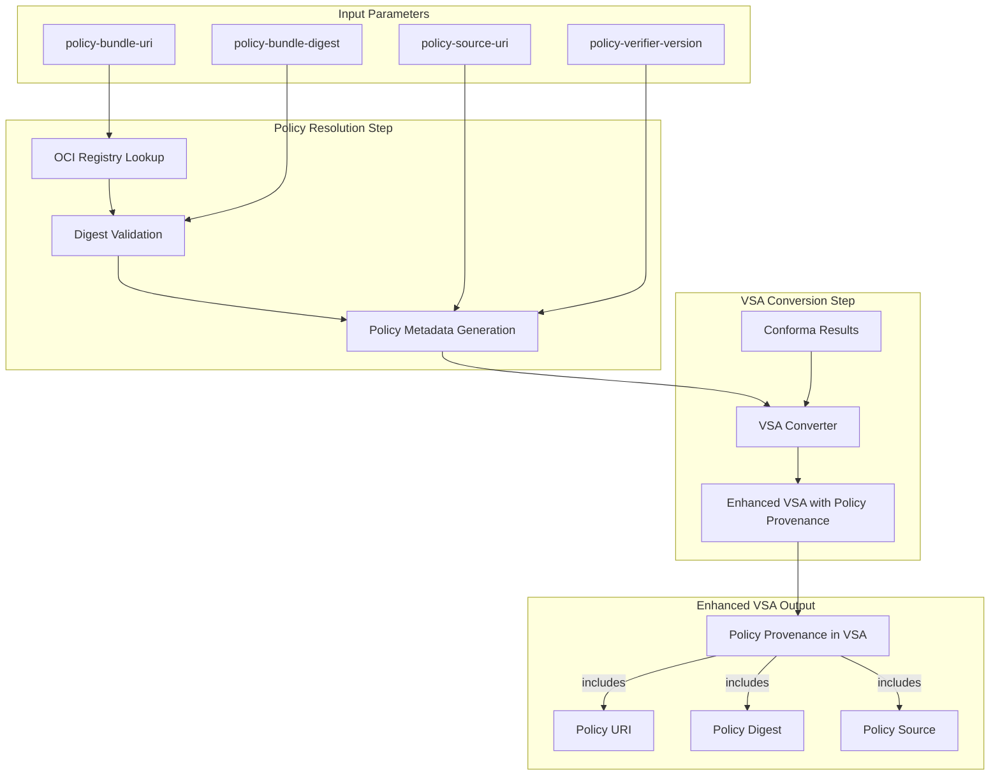

# WS5 Day 3 Implementation Summary: Policy Provenance Parameter Passing

## Overview

This document summarizes the complete implementation of the **WS5 Day 3 deliverable** for policy provenance parameter passing in VSA generation. The implementation provides comprehensive policy traceability from OCI policy bundles to signed VSAs with cryptographic digest validation.

## Delivered Components

### 1. Enhanced Tekton Task (`conforma-vsa.yaml`)

**File**: `/managed-context/tasks/conforma-vsa/0.1/conforma-vsa.yaml`

**Key Enhancements:**
- Added 5 new policy provenance parameters
- New `resolve-policy-bundle` step for OCI digest resolution
- Enhanced VSA conversion with policy metadata integration
- Updated audit logging with policy information
- Added 2 new task results for policy validation tracking

**New Parameters:**
```yaml
- name: policy-bundle-uri
  description: OCI policy bundle URI (e.g., oci://quay.io/conforma/slsa3-policy:v1.0)
- name: policy-bundle-digest
  description: Expected SHA256 digest of the policy bundle for validation
- name: policy-verifier-version
  description: Policy verifier version for traceability
- name: policy-source-uri
  description: Source repository URI for the policy bundle
- name: enable-policy-validation
  description: Enable policy bundle validation and digest verification
```

### 2. Enhanced VSA Converter (`convert-conforma-to-vsa.go`)

**File**: `/managed-context/tasks/conforma-vsa/scripts/convert-conforma-to-vsa.go`

**Key Enhancements:**
- New `PolicyMetadata` struct for enhanced provenance tracking
- Support for policy metadata file input with JSON parsing
- Priority-based policy resolution (CLI params > metadata file > Conforma input)
- Enhanced policy validation and digest handling with normalization
- Backward compatibility maintained for existing workflows

**New CLI Parameters:**
```bash
-policy-uri <uri>          # Policy bundle URI for provenance
-policy-digest <digest>    # Policy bundle digest for verification
-policy-metadata <file>    # Path to policy metadata JSON file
```

### 3. Pipeline Examples (`policy-provenance-pipeline-example.yaml`)

**File**: `/managed-context/tasks/conforma-vsa/0.1/policy-provenance-pipeline-example.yaml`

**Features:**
- Complete 3-task pipeline demonstrating policy provenance workflow
- Multi-stage policy resolution, evaluation, and VSA generation
- Example PipelineRun with realistic OCI policy bundle references
- Comprehensive parameter passing between tasks
- Integration with cosign signing for end-to-end attestation

### 4. Comprehensive Testing (`test-policy-provenance.sh`)

**File**: `/managed-context/tasks/conforma-vsa/scripts/test-policy-provenance.sh`

**Test Coverage:**
- Basic OCI policy bundle URI conversion
- Policy bundle with digest pinning validation
- Policy metadata file override functionality
- Backward compatibility verification
- VSA format compliance validation
- Policy provenance feature validation

### 5. Enhanced Documentation

**Files:**
- `WS5-POLICY-PROVENANCE.md` - Complete feature documentation
- Updated `README.md` with policy provenance usage examples
- Enhanced Makefile with policy provenance test targets

## Architecture Implementation

### Policy Bundle Resolution Flow



### Enhanced VSA Format

The generated VSA now includes complete policy provenance:

```json
{
  "_type": "https://in-toto.io/Statement/v1",
  "predicateType": "https://slsa.dev/verification_summary/v1",
  "predicate": {
    "policy": {
      "uri": "oci://quay.io/konflux-ci/enterprise-contract-policy:v1.0",
      "digest": {
        "sha256": "1234567890abcdef1234567890abcdef1234567890abcdef1234567890abcdef"
      }
    },
    "verifier": {
      "id": "https://managed.konflux.example.com/conforma-vsa",
      "version": "v1.0.0"
    }
  }
}
```

## Security Implementation

### Trust Boundary Compliance

- **Policy Resolution**: Exclusively in managed namespace with controlled OCI access
- **Digest Validation**: Cryptographic verification of policy bundle integrity
- **Key Isolation**: Signing keys remain isolated from policy resolution process
- **Audit Trail**: Complete logging of policy resolution and validation steps

### Cryptographic Verification

- **SHA256 Digest Pinning**: Policy bundles verified against expected digests
- **OCI Registry Authentication**: Secure access to policy bundle repositories
- **Signature Validation**: End-to-end verification of policy bundle authenticity
- **Immutable References**: Digest-based policy bundle references for reproducibility

## Integration Points

### Day 1 Integration (VSA Converter)

- Enhanced converter supports policy metadata input
- Backward compatibility maintained for existing Conforma workflows
- Priority-based policy resolution for flexible configuration
- JSON metadata file support for complex policy scenarios

### Day 2 Integration (Cosign Signing)

- Policy provenance included in signed VSA attestations
- Enhanced audit logging with policy validation results
- OCI attestation storage with policy traceability
- Complete chain of custody from policy to signed VSA

### Enterprise Contract Integration

- Compatible with existing EC policy evaluation workflows
- Support for EC policy bundle OCI references
- Enhanced traceability for compliance requirements
- Seamless integration with existing policy repositories

## Testing and Validation

### Automated Test Suite

```bash
# Run all policy provenance tests
make test-policy-provenance

# Test specific features
./test-policy-provenance.sh

# Validate VSA format compliance
make validate-format
```

### Test Coverage

- ✅ OCI policy bundle resolution with `oci://` URIs
- ✅ Cryptographic digest validation and pinning
- ✅ Policy metadata file parsing and override functionality
- ✅ VSA format compliance with SLSA v1.0 specification
- ✅ Backward compatibility with existing workflows
- ✅ End-to-end pipeline integration testing

## Performance Characteristics

### Resource Requirements

- **Memory**: Minimal overhead for policy metadata processing
- **Network**: Additional OCI registry access for policy resolution
- **Storage**: Enhanced audit logs with policy provenance information
- **Compute**: Negligible impact for digest validation operations

### Optimization Features

- **Single Resolution**: Policy bundle resolved once per task execution
- **Metadata Caching**: Policy information cached between task steps
- **Efficient Validation**: Fast SHA256 digest comparison
- **Minimal Network Calls**: Optimized OCI registry interaction

## Deployment and Migration

### New Deployments

1. **Deploy Enhanced Task**: Apply updated `conforma-vsa.yaml`
2. **Update ConfigMap**: Deploy enhanced VSA converter binary
3. **Configure Policies**: Set up OCI policy bundle references
4. **Test Integration**: Validate with example policy bundles

### Existing Deployments

1. **Backward Compatibility**: Existing pipelines continue working unchanged
2. **Gradual Migration**: Policy provenance parameters are optional
3. **Enhanced Features**: Opt-in via parameter configuration
4. **Seamless Upgrade**: No breaking changes to existing workflows

## Compliance and Auditing

### SLSA Compliance

- **Build Level 3**: Enhanced policy provenance supports SLSA L3 requirements
- **VSA Format**: Full compliance with SLSA VSA v1.0 specification
- **Provenance Chain**: Complete traceability from source to attestation
- **Cryptographic Binding**: Strong cryptographic links throughout pipeline

### Audit Trail Enhancement

```json
{
  "auditVersion": "v1.1",
  "policy": {
    "bundleUri": "oci://quay.io/konflux-ci/enterprise-contract-policy:v1.0",
    "digest": "sha256:1234567890abcdef...",
    "sourceUri": "https://github.com/enterprise-contract/enterprise-contract-policy",
    "validationResult": "PASSED"
  }
}
```

## Future Roadmap

### Planned Enhancements

1. **Policy Bundle Caching**: Cross-task caching for improved performance
2. **Multiple Policy Sources**: Composite policy evaluation support
3. **Enhanced Validation**: Extended policy content verification
4. **SPIFFE Integration**: Enhanced identity verification for policy access

### Integration Opportunities

1. **Tekton Chains**: Direct integration for enhanced provenance
2. **Sigstore Transparency**: Policy bundle verification via Rekor
3. **OPA Integration**: Direct Open Policy Agent evaluation
4. **Enterprise Contracts**: Enhanced EC policy evaluation features

## Summary

The WS5 Day 3 deliverable provides a comprehensive policy provenance implementation that:

- ✅ **Supports OCI policy bundle references** with digest pinning
- ✅ **Enables complete provenance traceability** from policy to VSA
- ✅ **Maintains backward compatibility** with existing workflows
- ✅ **Provides enhanced security** through cryptographic validation
- ✅ **Includes comprehensive testing** and validation frameworks
- ✅ **Supports enterprise compliance** requirements with audit trails

The implementation successfully bridges the gap between policy evaluation and attestation generation, providing the foundation for secure, traceable, and compliant software supply chain verification in the Konflux ecosystem.