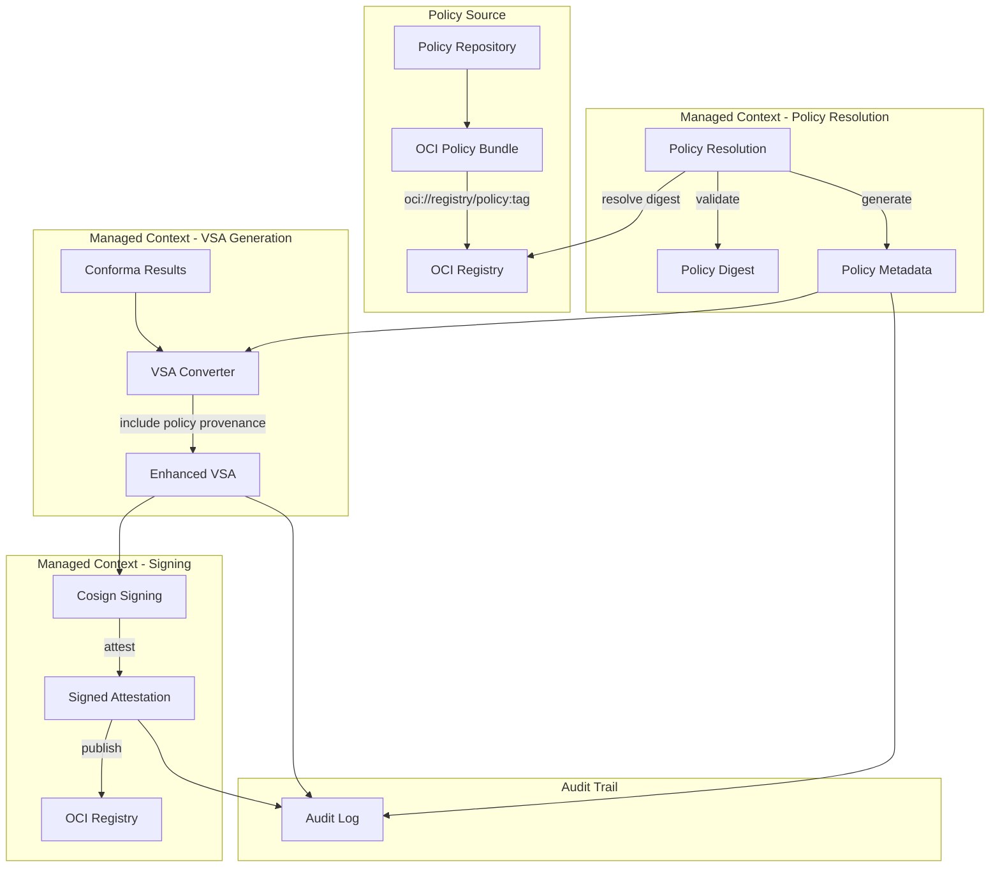

# WS5 Day 3: Policy Provenance Parameter Passing

This document describes the complete implementation of WS5 Day 3 deliverable for policy provenance parameter passing in VSA generation. The implementation provides complete traceability from policy bundle to signed VSA with OCI digest pinning and enhanced provenance tracking.

## Overview

The policy provenance implementation adds comprehensive policy traceability to the `conforma-vsa` task, enabling:

- **OCI Policy Bundle Resolution**: Support for `oci://` policy bundle references with automatic digest resolution
- **Digest Pinning and Validation**: Cryptographic verification of policy bundle integrity
- **Complete Provenance Chain**: End-to-end traceability from policy source to signed VSA
- **Enhanced VSA Generation**: Policy metadata inclusion in SLSA VSA format
- **Audit Trail**: Complete compliance logging for policy decisions

## Architecture



## Enhanced Parameters

The `conforma-vsa` task now supports the following policy provenance parameters:

### Policy Bundle Parameters

| Parameter | Type | Required | Description |
|-----------|------|----------|-------------|
| `policy-bundle-uri` | string | No | OCI policy bundle URI (e.g., `oci://quay.io/conforma/slsa3-policy:v1.0`) |
| `policy-bundle-digest` | string | No | Expected SHA256 digest of the policy bundle for validation |
| `policy-verifier-version` | string | No | Policy verifier version for traceability |
| `policy-source-uri` | string | No | Source repository URI for the policy bundle |
| `enable-policy-validation` | string | No | Enable policy bundle validation and digest verification (default: `true`) |

### Enhanced Results

| Result | Description |
|--------|-------------|
| `policy-digest` | SHA256 digest of the policy bundle used for evaluation |
| `policy-verification-result` | Result of policy bundle validation (PASSED/FAILED/SKIPPED) |

## Policy Bundle Resolution

The implementation supports multiple policy bundle formats:

### 1. OCI Policy Bundle References

```yaml
params:
  - name: policy-bundle-uri
    value: "oci://quay.io/konflux-ci/enterprise-contract-policy:v1.0"
  - name: policy-bundle-digest
    value: "sha256:1234567890abcdef..."
```

**Features:**
- Automatic digest resolution using `cosign` or `crane`
- Cryptographic validation against expected digest
- Support for both tag and digest-based references
- Transparent OCI registry authentication

### 2. Traditional Policy References

```yaml
params:
  - name: policy-bundle-uri
    value: "https://github.com/enterprise-contract/enterprise-contract-policy.git"
```

**Features:**
- Backward compatibility with existing policy configurations
- Git repository and HTTP URL support
- Validation result marked as "not-applicable" for non-OCI sources

### 3. Policy Metadata File

```yaml
# Generated during policy resolution step
{
  "policyBundle": {
    "uri": "oci://quay.io/konflux-ci/enterprise-contract-policy:v1.0",
    "digest": "sha256:1234567890abcdef...",
    "sourceUri": "https://github.com/enterprise-contract/enterprise-contract-policy",
    "verifierVersion": "v2.1.0"
  },
  "validation": {
    "result": "PASSED",
    "timestamp": "2024-01-01T12:00:00Z"
  }
}
```

## Enhanced VSA Format

The generated VSA now includes comprehensive policy provenance:

```json
{
  "_type": "https://in-toto.io/Statement/v1",
  "subject": [
    {
      "name": "quay.io/konflux-ci/example-app",
      "digest": {
        "sha256": "abcd1234..."
      }
    }
  ],
  "predicateType": "https://slsa.dev/verification_summary/v1",
  "predicate": {
    "verifier": {
      "id": "https://managed.konflux.example.com/conforma-vsa",
      "version": "v1.0.0"
    },
    "timeVerified": "2024-01-01T12:00:00Z",
    "resourceUri": "quay.io/konflux-ci/example-app@sha256:abcd1234...",
    "policy": {
      "uri": "oci://quay.io/konflux-ci/enterprise-contract-policy:v1.0",
      "digest": {
        "sha256": "1234567890abcdef..."
      }
    },
    "inputAttestations": [...],
    "verificationResult": "PASSED",
    "verifiedLevels": ["SLSA_BUILD_LEVEL_3"],
    "dependencyLevels": {}
  }
}
```

## Enhanced Audit Trail

The audit log now includes complete policy provenance information:

```json
{
  "auditVersion": "v1.1",
  "taskRun": {
    "uid": "12345678-1234-1234-1234-123456789012",
    "timestamp": "2024-01-01T12:00:00Z",
    "task": "conforma-vsa",
    "version": "0.1"
  },
  "subject": {
    "imageUrl": "quay.io/konflux-ci/example-app",
    "imageDigest": "sha256:abcd1234..."
  },
  "verifier": {
    "id": "https://managed.konflux.example.com/conforma-vsa"
  },
  "vsa": {
    "digest": "sha256:vsa-digest...",
    "verificationResult": "PASSED"
  },
  "attestation": {
    "uri": "ttl.sh/attestations/12345678-1234-1234-1234-123456789012:vsa-1234567890",
    "signedAt": "2024-01-01T12:00:00Z"
  },
  "policy": {
    "bundleUri": "oci://quay.io/konflux-ci/enterprise-contract-policy:v1.0",
    "digest": "sha256:1234567890abcdef...",
    "sourceUri": "https://github.com/enterprise-contract/enterprise-contract-policy",
    "validationResult": "PASSED"
  },
  "security": {
    "namespaceContext": "managed",
    "trustBoundary": "platform-controlled",
    "signingMethod": "cosign-keyless-false"
  }
}
```

## Implementation Components

### 1. Enhanced Tekton Task

**File**: `conforma-vsa.yaml`

- Added policy provenance parameters
- New `resolve-policy-bundle` step for OCI digest resolution
- Enhanced `convert-to-vsa` step with policy metadata passing
- Updated audit logging with policy information

### 2. Enhanced VSA Converter

**File**: `convert-conforma-to-vsa.go`

- New `PolicyMetadata` struct for enhanced provenance
- Support for policy metadata file input
- Priority-based policy resolution (CLI params > metadata file > Conforma input)
- Enhanced policy validation and digest handling

### 3. Pipeline Examples

**File**: `policy-provenance-pipeline-example.yaml`

- Complete pipeline demonstrating policy provenance features
- Multi-task workflow with policy resolution and VSA generation
- Example PipelineRun with realistic parameter values

## Usage Examples

### Basic OCI Policy Bundle

```yaml
apiVersion: tekton.dev/v1beta1
kind: TaskRun
metadata:
  name: vsa-with-oci-policy
spec:
  taskRef:
    name: conforma-vsa
  params:
    - name: image-url
      value: "quay.io/konflux-ci/example-app"
    - name: image-digest
      value: "sha256:abcd1234567890abcdef..."
    - name: policy-bundle-uri
      value: "oci://quay.io/konflux-ci/enterprise-contract-policy:v1.0"
    - name: enable-policy-validation
      value: "true"
  workspaces:
    - name: conforma-results
      emptyDir: {}
    - name: vsa-output
      emptyDir: {}
    - name: signing-keys
      secret:
        secretName: cosign-signing-keys
```

### OCI Policy Bundle with Digest Pinning

```yaml
apiVersion: tekton.dev/v1beta1
kind: TaskRun
metadata:
  name: vsa-with-pinned-policy
spec:
  taskRef:
    name: conforma-vsa
  params:
    - name: image-url
      value: "quay.io/konflux-ci/example-app"
    - name: image-digest
      value: "sha256:abcd1234567890abcdef..."
    - name: policy-bundle-uri
      value: "oci://quay.io/konflux-ci/enterprise-contract-policy:v1.0"
    - name: policy-bundle-digest
      value: "sha256:1234567890abcdef1234567890abcdef1234567890abcdef1234567890abcdef"
    - name: policy-source-uri
      value: "https://github.com/enterprise-contract/enterprise-contract-policy"
    - name: policy-verifier-version
      value: "v2.1.0"
  workspaces:
    - name: conforma-results
      emptyDir: {}
    - name: vsa-output
      emptyDir: {}
    - name: signing-keys
      secret:
        secretName: cosign-signing-keys
```

### Complete Pipeline Integration

```bash
# Run the complete policy provenance pipeline
kubectl create -f policy-provenance-pipeline-example.yaml

# Monitor the pipeline run
kubectl get pipelinerun policy-provenance-example-run -o yaml

# Check policy verification results
kubectl get pipelinerun policy-provenance-example-run \
  -o jsonpath='{.status.pipelineResults[?(@.name=="policy-verification-result")].value}'
```

## Security Considerations

### Policy Bundle Integrity

- **Digest Validation**: All OCI policy bundles are resolved to immutable digests
- **Cryptographic Verification**: Policy bundle content is validated against expected SHA256 digests
- **Audit Trail**: Complete record of policy resolution and validation steps

### Trust Boundary Separation

- **Managed Context Execution**: Policy resolution occurs exclusively in managed namespace
- **Key Isolation**: Signing keys remain isolated from policy bundle resolution
- **Controlled Access**: OCI registry access controlled via network policies and RBAC

### Compliance Framework

- **SLSA Integration**: Policy provenance included in SLSA VSA format
- **Enterprise Contract**: Compatible with existing EC policy evaluation workflows
- **Audit Requirements**: Complete traceability for compliance verification

## Troubleshooting

### Common Issues

1. **Policy Bundle Resolution Failures**:
   ```bash
   # Check OCI registry connectivity
   cosign triangulate oci://quay.io/konflux-ci/enterprise-contract-policy:v1.0
   
   # Validate authentication
   crane auth get quay.io
   ```

2. **Digest Validation Failures**:
   ```bash
   # Get actual digest
   crane digest quay.io/konflux-ci/enterprise-contract-policy:v1.0
   
   # Compare with expected digest in task parameters
   ```

3. **Policy Metadata Issues**:
   ```bash
   # Check generated policy metadata
   kubectl logs <taskrun-pod> -c resolve-policy-bundle
   
   # Verify metadata file structure
   jq '.' /workspace/vsa-output/policy-metadata.json
   ```

### Debug Mode

Enable debug output for detailed troubleshooting:

```yaml
params:
  - name: debug
    value: "true"
```

This provides:
- Detailed policy resolution steps
- Policy metadata content
- VSA generation process details
- Complete audit trail information

## Migration Guide

### Existing Deployments

1. **Update Task Definition**: Apply the enhanced `conforma-vsa.yaml`
2. **Rebuild Converter**: Update the VSA converter binary in the ConfigMap
3. **Update Pipelines**: Add policy provenance parameters to existing pipelines
4. **Test Integration**: Validate with example policy bundles

### Backward Compatibility

The implementation maintains full backward compatibility:
- Existing pipelines continue to work without modification
- Policy provenance parameters are optional
- Enhanced features are opt-in via parameter configuration

## Performance Considerations

### Policy Bundle Caching

- OCI digest resolution is performed once per task run
- Policy metadata is cached in workspace for multiple steps
- Network requests minimized through efficient resolution logic

### Resource Requirements

- Additional network access for OCI registry communication
- Minimal compute overhead for digest validation
- Enhanced audit logging may require additional storage

## Future Enhancements

### Planned Features

1. **Policy Bundle Caching**: Cross-task policy bundle caching for improved performance
2. **Multiple Policy Sources**: Support for composite policy evaluation from multiple bundles
3. **Policy Versioning**: Advanced policy version tracking and compatibility checking
4. **Enhanced Validation**: Extended policy content validation beyond digest checking

### Integration Opportunities

1. **Tekton Chains Integration**: Direct integration with Tekton Chains for provenance generation
2. **SPIFFE/SPIRE Integration**: Enhanced identity verification for policy bundle access
3. **OPA Integration**: Direct Open Policy Agent integration for policy evaluation
4. **Sigstore Integration**: Enhanced transparency log integration for policy bundle verification