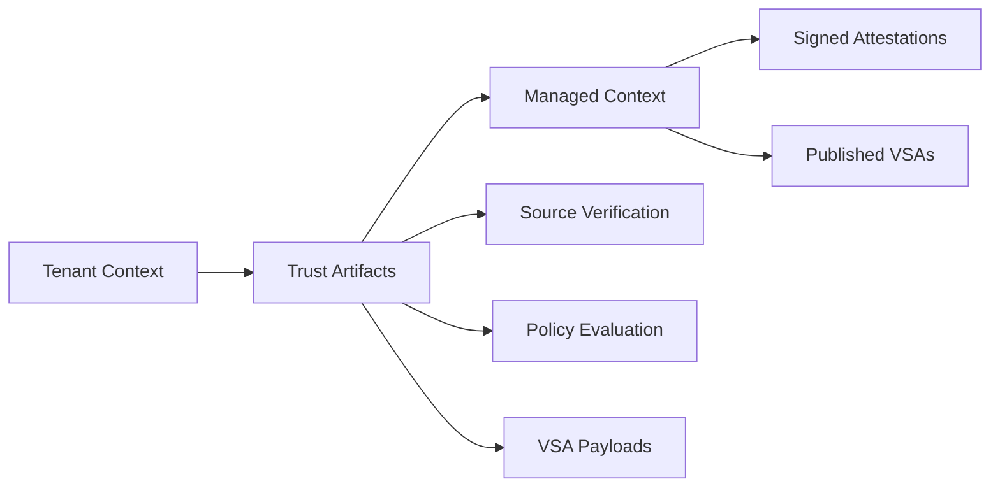

# Shared Components

This directory contains components and artifacts that are shared between the tenant and managed contexts. These provide the foundation for trust artifact exchange and common data formats.

## 🎯 Purpose

- **Trust Artifact Exchange**: Standardized formats for verification data
- **Schema Definitions**: Common data structures across contexts
- **Cross-Context Communication**: Secure data transfer mechanisms
- **Compliance Frameworks**: Shared compliance and validation schemas

## 📁 Directory Structure

```
shared/
├── trust-artifacts/         # Trust artifact specifications
│   ├── schemas/             # Trust artifact data schemas
│   ├── examples/            # Example trust artifacts
│   └── validation/          # Validation tools and scripts
└── schemas/                 # Common data format definitions
    ├── slsa/                # SLSA-specific schemas
    ├── vsa/                 # VSA format definitions
    └── policy/              # Policy evaluation schemas
```

## 🔄 Trust Artifact Flow



## 📋 Trust Artifact Types

### Source Verification Artifacts
**Purpose**: Communicate source code verification results
**Producer**: git-clone-slsa task (tenant context)
**Consumer**: VSA generation (managed context)

**Schema**: `trust-artifacts/schemas/source-verification.json`

### Policy Evaluation Artifacts
**Purpose**: Convey policy evaluation outcomes and evidence
**Producer**: conforma-vsa task (tenant context)
**Consumer**: VSA signing (managed context)

**Schema**: `trust-artifacts/schemas/policy-evaluation.json`

### VSA Payloads
**Purpose**: Prepared VSA content for final signing
**Producer**: conforma-vsa task (tenant context)
**Consumer**: vsa-sign task (managed context)

**Schema**: `trust-artifacts/schemas/vsa-payload.json`

## 🔒 Security Properties

### Cryptographic Integrity
- All trust artifacts include cryptographic hashes
- Tamper-evident storage and transfer
- Chain of custody preservation
- Integrity validation at consumption

### Access Control
- Read-only access from managed context
- Write-only access from tenant context
- Network isolation between contexts
- Audit logging for all access

### Data Format Security
- Schema validation for all artifacts
- Type safety and validation
- Structured error handling
- Defensive parsing and processing

## 📊 Schema Definitions

### Source Verification Schema
```json
{
  "$schema": "https://json-schema.org/draft/2020-12/schema",
  "title": "Source Verification Trust Artifact",
  "type": "object",
  "properties": {
    "version": {
      "type": "string",
      "enum": ["1.0"]
    },
    "timestamp": {
      "type": "string",
      "format": "date-time"
    },
    "producer": {
      "type": "object",
      "properties": {
        "id": {"type": "string"},
        "version": {"type": "string"}
      },
      "required": ["id", "version"]
    },
    "verification": {
      "type": "object",
      "properties": {
        "status": {
          "type": "string",
          "enum": ["pass", "fail"]
        },
        "repository": {"type": "string"},
        "commit": {"type": "string"},
        "signatures": {
          "type": "object",
          "properties": {
            "verified": {"type": "boolean"},
            "signers": {
              "type": "array",
              "items": {"type": "string"}
            }
          }
        }
      },
      "required": ["status", "repository", "commit"]
    },
    "integrity": {
      "type": "object",
      "properties": {
        "sha256": {"type": "string"}
      },
      "required": ["sha256"]
    }
  },
  "required": ["version", "timestamp", "producer", "verification", "integrity"]
}
```

### Policy Evaluation Schema
```json
{
  "$schema": "https://json-schema.org/draft/2020-12/schema",
  "title": "Policy Evaluation Trust Artifact",
  "type": "object",
  "properties": {
    "version": {
      "type": "string",
      "enum": ["1.0"]
    },
    "timestamp": {
      "type": "string",
      "format": "date-time"
    },
    "producer": {
      "type": "object",
      "properties": {
        "id": {"type": "string"},
        "version": {"type": "string"}
      },
      "required": ["id", "version"]
    },
    "evaluation": {
      "type": "object",
      "properties": {
        "result": {
          "type": "string",
          "enum": ["pass", "fail", "warning"]
        },
        "policy": {
          "type": "object",
          "properties": {
            "uri": {"type": "string"},
            "digest": {"type": "string"}
          },
          "required": ["uri", "digest"]
        },
        "violations": {
          "type": "array",
          "items": {
            "type": "object",
            "properties": {
              "rule": {"type": "string"},
              "severity": {"type": "string"},
              "message": {"type": "string"}
            }
          }
        }
      },
      "required": ["result", "policy"]
    },
    "evidence": {
      "type": "object",
      "properties": {
        "path": {"type": "string"},
        "digest": {"type": "string"}
      },
      "required": ["path", "digest"]
    },
    "integrity": {
      "type": "object",
      "properties": {
        "sha256": {"type": "string"}
      },
      "required": ["sha256"]
    }
  },
  "required": ["version", "timestamp", "producer", "evaluation", "evidence", "integrity"]
}
```

## 🛠️ Validation Tools

### Trust Artifact Validator
```bash
#!/bin/bash
# validate-trust-artifact.sh

ARTIFACT_PATH=$1
SCHEMA_PATH=$2

# Validate JSON schema
jsonschema -i "$ARTIFACT_PATH" "$SCHEMA_PATH"

# Verify cryptographic integrity
EXPECTED_HASH=$(jq -r '.integrity.sha256' "$ARTIFACT_PATH")
ACTUAL_HASH=$(jq 'del(.integrity)' "$ARTIFACT_PATH" | sha256sum | cut -d' ' -f1)

if [ "$EXPECTED_HASH" != "$ACTUAL_HASH" ]; then
  echo "ERROR: Integrity validation failed"
  exit 1
fi

echo "Trust artifact validation passed"
```

### Schema Validation Integration
```yaml
# Validation task for trust artifacts
apiVersion: tekton.dev/v1beta1
kind: Task
metadata:
  name: validate-trust-artifact
spec:
  params:
    - name: artifactPath
      type: string
    - name: schemaType
      type: string
  steps:
    - name: validate
      image: ghcr.io/konflux-ci/trust-validator:latest
      script: |
        #!/bin/bash
        validate-trust-artifact.sh \
          $(params.artifactPath) \
          /schemas/$(params.schemaType).json
```

## 📝 Usage Examples

### Producing Trust Artifacts
```bash
# From tenant context task
cat > trust-artifact.json << EOF
{
  "version": "1.0",
  "timestamp": "$(date -u +%Y-%m-%dT%H:%M:%SZ)",
  "producer": {
    "id": "git-clone-slsa",
    "version": "v1.0.0"
  },
  "verification": {
    "status": "pass",
    "repository": "https://github.com/example/repo",
    "commit": "abc123...",
    "signatures": {
      "verified": true,
      "signers": ["developer@example.com"]
    }
  }
}
EOF

# Calculate and add integrity hash
HASH=$(jq 'del(.integrity)' trust-artifact.json | sha256sum | cut -d' ' -f1)
jq --arg hash "$HASH" '.integrity.sha256 = $hash' trust-artifact.json > final-artifact.json
```

### Consuming Trust Artifacts
```bash
# From managed context task
# Validate trust artifact
validate-trust-artifact.sh trust-artifact.json /schemas/source-verification.json

# Extract verification status
STATUS=$(jq -r '.verification.status' trust-artifact.json)
if [ "$STATUS" != "pass" ]; then
  echo "ERROR: Source verification failed"
  exit 1
fi

# Use in VSA generation
vsa-generator create \
  --source-verification=trust-artifact.json \
  --output=vsa.json
```

## 🧪 Testing

### Schema Validation Tests
```bash
# Test all schema definitions
cd shared/schemas
for schema in *.json; do
  echo "Testing schema: $schema"
  jsonschema --instance ../trust-artifacts/examples/example.json "$schema"
done
```

### Integration Tests
```bash
# Test trust artifact flow
kubectl apply -f ../tenant-context/pipelines/test-build-pipeline.yaml
kubectl apply -f ../managed-context/pipelines/test-release-pipeline.yaml

# Verify trust artifact exchange
kubectl logs -l app=trust-artifact-validator
```

## 📖 Related Documentation

- [Trust Model](../docs/trust-model.md) - Overall security architecture
- [Data Flow](../docs/data-flow.md) - Trust artifact flow documentation
- [Schema Reference](../docs/schema-reference.md) - Complete schema documentation
- [Validation Guide](../docs/validation-guide.md) - Trust artifact validation procedures